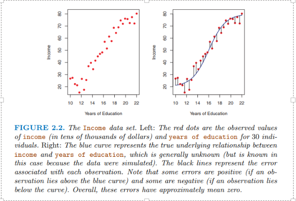
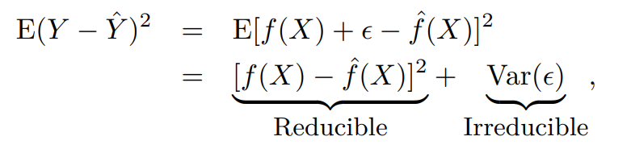
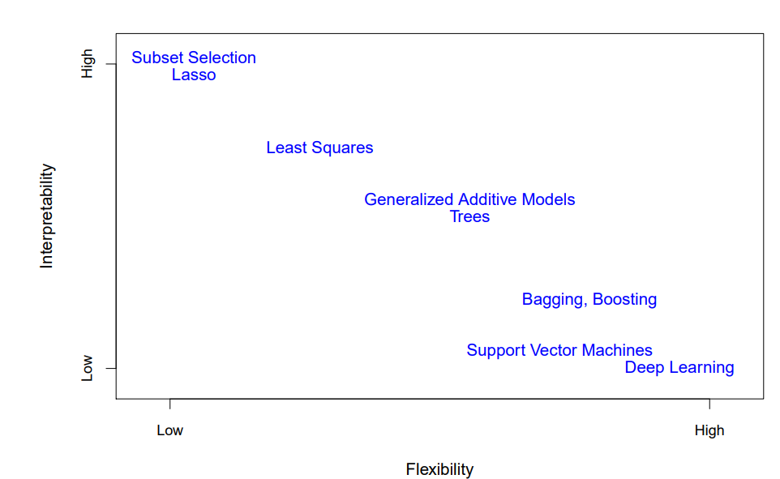
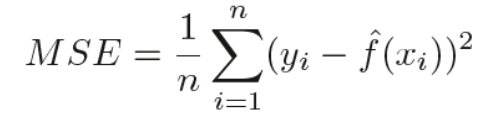
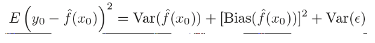
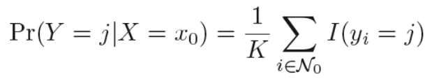

Notes:
**Summary of ISLR Book** 

An Introduction to Statistical Learning -  [An Introduction to Statistical Learning (statlearning.com)](https://www.statlearning.com/)

- **18-Aug-19** (Page: 1-16)
    - Statistical Learning -> Understanding (Making sense of) data using various tools
        - 2 types: Supervised (Predicting output based on input), Unsupervised (No Supervising output but inputs are there)
    - Continuous or Quantitative output -> **Regression** [Legendre & Gauss : Generalized linear models]
    - Categorical or Qualitative output from continuous output -> **Classification** [Fisher : Generalized additive models]
    - No Corresponding Output & only input is there -> **Clustering**
    - In Linear Regression, Mean of error is zero as there is equal amount of +ve and -ve errors which cancels out
    
    
    
- **21-Aug-19** (Page: 16-21)
    - **Y = F(X)** needs to be estimated to predict y depending on x using f as (Depends on situation & scenarios mentioned)
        - Prediction (Predict if Customer will respond +vely or not)
            - Reducible error (error associated with estimating f, which can be reduced)
            - Irreducible error (error associated with error e which varies so irreducible)
            
           
            
        - Inference (Which improved sales bcoz of advertisement)
        - Both (Real Estate: Predict & Infer)
    - Estimated by using training data with 2 methods [so, Y~F(X)]
        - Parametric
        - Non Parametric
        
       
        
- **24-Aug-19** (Page: 21-33)
    - Parametric Methods
        - 2 steps: estimate f; **Model** to fit for estimating parameters
        - Model based approach where estimating f is reduced to estimating parameters
        - Might not capture everything-> *flexible models* -> may lead to **overfitting** (small training MSE but large test MSE)
        - can work with small dataset and is preferred
    - Non Parametric Methods
        - Instead of fitting f to Model, it **estimates**
    - Needs large number of observations as tends to overfits the data
- Depending on Inference or Prediction chose the above models (Generally, Inference-less flexible models, Prediction-more flexible models)
- Model accuracy
    - Quality of Fit: MSE
    
    
    
- We are interested in test data (MSE): Model is selected with lowest test MSE
- **25-Aug-19** (Page: 33-39)
    - Test MSE attributed to 3 terms:
        - Variance of f(x)
        - Variance of error
        - Squared bias of f(x)
        
        
        
- **Bias variance tradeoff**> To minimize test MSE: *low variance* and *low bias* needed (non-negative->irreducible, unlike mean)
    - Generally, flexible methods have high variance and low bias
    - Bayer's classifier
        - Assigns each obs to mostly likely class given its predictor values (**conditional probability**)
        - By Bayer's classifier with Bayes decision boundary gets the Bayes error rate (irreducible)
- **26-Aug-19** (Page: 39-59)
    - K nearest neighbor: Estimate conditional probability and then class with highest *estimated* probability (Since, real world Bayers not known always): Used for Classification & Regression
    

    
    
- Estimating K is very important as it may lead to bias variance tradeoff (low k, k=1 will overfit; high k, k=100 will be less flexible causing high variance)
- **26-Dec-22** (Page: 69)
    - Linear Regression:
